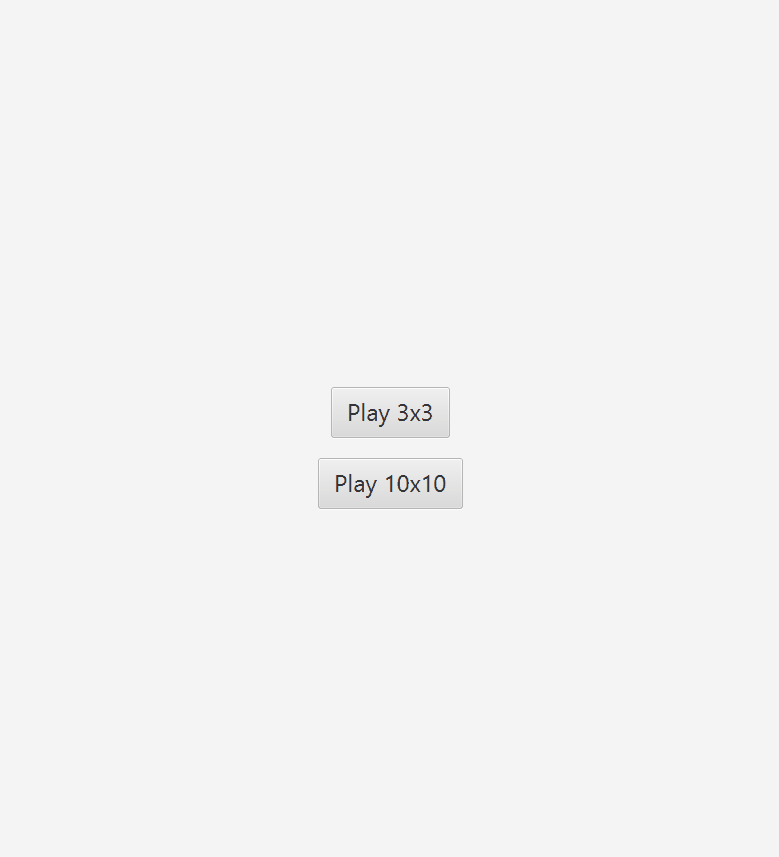

# TicTacToe Game

## Author: Bartlomiej Lorenowicz

This TicTacToe game is built with Java, JavaFX and Gradle.  
It includes AI logic, a ranking system, game saving & loading, and two board sizes (3×3 and 10×10).

---

## 🎮 Features
- 3×3 and 10×10 game modes
- Hard & Easy AI difficulty
- AI blocking and winning logic
- Game state auto-saving and loading
- Ranking system with persistent storage
- JavaFX graphical interface
- Option to return to main menu
- Reset game button

---
🧱 Technologies

Java 17

JavaFX 21

Gradle

JUnit 5

Object Serialization


## ▶️ How to Run

### Using Gradle
```bash
./gradlew run
```
🖼️ Screenshots & Animation
🎥 Gameplay Animation

